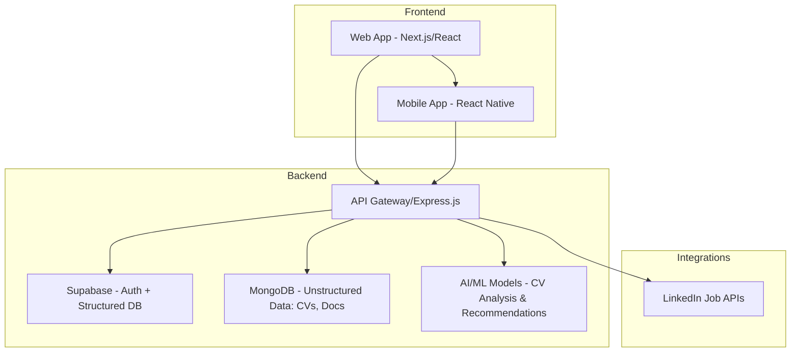

# Dynamic Youth Profiling System for Employment (DYPSE)

## Overview
The **Dynamic Youth Profiling System for Employment (DYPSE)** is a web and mobile application designed to tackle youth unemployment by creating a dynamic ecosystem that connects **job seekers, employed professionals, and entrepreneurs** with opportunities. The platform integrates **AI-powered analysis, Supabase for structured data, MongoDB for unstructured data (e.g., CV parsing, business docs), and LinkedIn Jobs integration** to create a one-stop hub for youth empowerment.

---

## Problem Statement
Youth unemployment remains a significant issue in Africa, with limited access to:
- Verified job opportunities
- Professional networks
- Entrepreneurial support
- Structured + unstructured career insights

Many systems lack integration of **real-time job updates, AI-powered skill-job matching, and validation for entrepreneurs**. DYPSE solves this gap.

---

## Core Objectives
- Provide a **youth-centered digital profile system**.
- Connect youth to **jobs, internships, and entrepreneurial opportunities**.
- Enable **AI-driven recommendations** for career growth.
- Foster **micro-business creation and networking** opportunities.
- Ensure **secure, scalable, and real-time integrations** with existing platforms like LinkedIn.

---

## Features

### 1. User Categories
- **Unemployed Youth**: Build a profile, upload CVs, apply to jobs.
- **Employed Youth**: Showcase career progress, skills, and experiences.
- **Entrepreneurs**: Register businesses with validation (business certificate, pictures, external links, referrers).

### 2. Core Functionalities
- **Profile Management**: Rich profiles with structured + unstructured data.
- **CV Analysis (AI + MongoDB)**: Extract skills, experience, and job-matching insights.
- **AI Recommendations**:
  - Job matches based on skills & interests.
  - Entrepreneurial opportunities.
  - Networking suggestions.
- **Real-time Updates**: New job postings, micro-business openings, internship deadlines.
- **LinkedIn Integration**: Auto-fetch job listings and sync with DYPSE.
- **Search & Matching**: Smart filters for users, jobs, and businesses.

### 3. Security & Validation
- Business verification (document uploads, validation via Supabase + MongoDB).
- User authentication with **Supabase Auth**.
- Data privacy and security protocols for sensitive info.

### 4. Coming Soon (Scalable Additions)
- Micro-business creation via partnerships.
- Youth-to-youth networking and mentorship system.
- Investment and funding opportunities.

---

## System Architecture



---

## Backend Integration Details

### Supabase
- **Authentication**: Email, OAuth (Google, LinkedIn).
- **Structured DB**: User profiles, job listings, entrepreneur registry.
- **Role-based access**: Admin, User, Employer.
- **APIs**: Real-time updates via Supabase subscriptions.

### MongoDB
- **Unstructured Data**:
  - CV uploads → parsed into skills & experiences.
  - Entrepreneur documents & media.
- **Data Analysis Pipelines**:
  - NLP for CV analysis.
  - ML models for matching skills to job opportunities.

### AI/ML Layer
- **Models**:
  - Resume parsing (NER for skills extraction).
  - Recommendation engine (collaborative filtering + content-based).
- **Output**:
  - Personalized job matches.
  - Career growth suggestions.
  - Entrepreneurial opportunity detection.

### LinkedIn Jobs Integration
- REST API integration for job scraping/fetching.
- Sync jobs into DYPSE with metadata (title, description, skills).
- Matching engine suggests relevant jobs to users.

---

## Application Deployment
- **Web App**: Next.js + Tailwind, hosted on Vercel/Netlify.
- **Mobile App**: React Native, deployed to Play Store & App Store.
- **Backend Services**: Node.js (Express/NestJS), hosted on AWS/GCP/Azure.
- **Databases**:
  - Supabase (Postgres)
  - MongoDB Atlas (Cloud-hosted)
- **AI Services**: Custom ML models deployed via AWS SageMaker or Hugging Face Inference API.

---

## Developer Guide

### Prerequisites
- Node.js (v18+)
- Supabase CLI
- MongoDB Atlas account
- LinkedIn API keys

### Setup
```bash
# Clone repo
git clone https://github.com/your-org/dypse.git
cd dypse

# Install dependencies
npm install

# Setup environment variables
cp .env.example .env

# Run local dev server
npm run dev
```

### Environment Variables
```env
SUPABASE_URL=your_supabase_url
SUPABASE_KEY=your_supabase_key
MONGODB_URI=your_mongo_uri
LINKEDIN_CLIENT_ID=your_linkedin_client_id
LINKEDIN_CLIENT_SECRET=your_linkedin_client_secret
AI_MODEL_ENDPOINT=your_ai_model_endpoint
```

### API Endpoints (Draft)
- `POST /api/auth/signup`
- `POST /api/auth/login`
- `POST /api/cv/upload`
- `GET /api/jobs`
- `POST /api/entrepreneurs/register`
- `GET /api/recommendations`

---

## Roadmap (Next 3 Milestones)
1. **MVP (Phase 1)**
   - User auth + profiles
   - CV upload + parsing
   - LinkedIn job integration
2. **Phase 2**
   - Entrepreneur validation workflows
   - AI recommendations
   - Real-time notifications
3. **Phase 3**
   - Networking features
   - Partnerships & micro-business creation
   - Funding & investments

---

## License
This project will be released under the **MIT License** (open to future changes based on stakeholders).

---

## Contributors
- ICT Chamber
- Pionners - Digital Talent Program 2025

---
